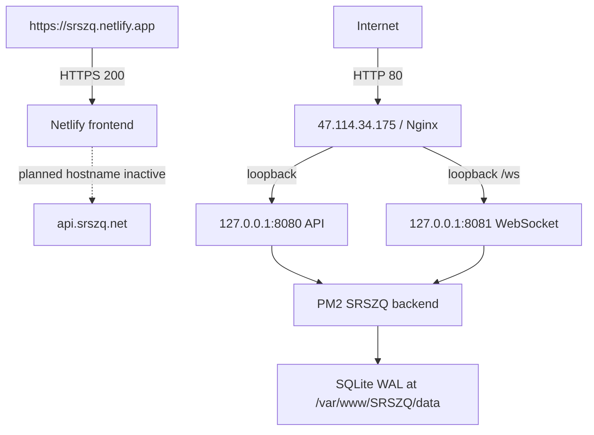
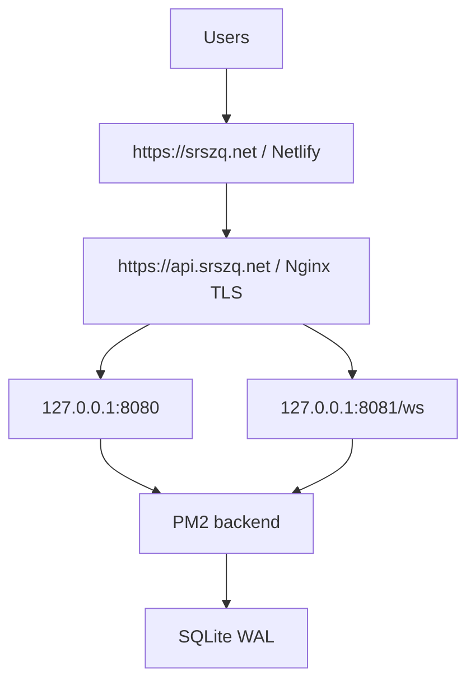

# SRSZQ production final handoff

Generated: 2026-09-06 (Asia/Shanghai)

```text
STATUS = PARTIALLY_READY
CURRENT_AUTOMATABLE_WORK = COMPLETE
BLOCKED_BY_DOMAIN_REGISTRATION_AND_ICP
```

## 1. Executive summary

The application code, backend runtime, persistent SQLite storage, verified backups, safe release automation, boot recovery, log rotation, repository security scan, GitHub CI and Netlify frontend are operational. A controlled ECS reboot proved that Nginx, PM2, the backend and the database recover automatically.

The final public product is not live on `srszq.net`. The domain has not been purchased, its Alibaba Cloud information template is reported as `Registry review pending`, ICP has not started/completed, and the backend has no public HTTPS/WSS hostname. These are the only launch blockers.

## 2. Git

- Repository: `https://github.com/xiao18825501901-rgb/SRSZQ.git` (private)
- Branch: `main`
- Deployed technical commit: `faf4b4ef75d90bc1236691e512e56267f98864b2`
- ECS working tree after deployment: clean
- Runtime SQLite files, WAL/SHM sidecars, environment files, PEMs and keys are ignored and untracked.
- Secret scan covered 144 tracked files across all 22 commits. No high-confidence GitHub, AWS, Netlify, Alibaba Cloud, Clerk, private-key or password literal was found.
- No force-push or history rewrite was performed.

## 3. Tests

All current gates passed locally and again in an isolated ECS release tree:

| Gate | Result |
|---|---|
| TypeScript type check | PASS |
| Unit tests | PASS: 7 files, 80 tests |
| Backend API integration | PASS: 10 scenarios |
| WebSocket integration | PASS: 14 scenarios |
| SQLite online backup tests | PASS: 3 tests |
| Frontend production build | PASS |
| `npm audit --audit-level=high` | PASS: 0 vulnerabilities |
| GitHub Actions CI for `faf4b4e` | PASS: run `34035660517` |

## 4. Build

- Node runtime: 24
- Netlify build: `npm run build`
- Publish directory: `frontend/dist`
- ECS release validation uses `npm ci --include=dev` in a separate temporary source tree before production changes.
- The validated frontend build contains the planned `.net` API and WSS URLs.

## 5. ECS

- Region: `cn-hangzhou`
- Instance: `i-bp1f0vqhds2341pdqqiy`
- Public IPv4: `47.114.34.175`
- OS: Ubuntu 22.04
- Application root: `/var/www/SRSZQ`
- Public OS listeners after reboot: SSH 22 and Nginx HTTP 80.
- API `127.0.0.1:8080` and WebSocket `127.0.0.1:8081` remain loopback-only.
- Port 443 is intentionally not listening until domain/ICP/TLS cutover.

## 6. PM2

- Application: `srszq-backend`, fork mode, one instance, online.
- `PM2_HOME=/root/.pm2`; current process list saved to `dump.pm2`.
- `pm2-root` is enabled and active.
- Controlled reboot test: PASS. PM2 restored the backend automatically with a new process and both loopback listeners returned.
- PM2 logs use native logrotate: daily, seven rotations, compressed, `copytruncate`, `missingok`.

## 7. Nginx

- Nginx is enabled and active; controlled reboot recovery passed.
- Current IP/default HTTP reverse proxy remains enabled.
- Versioned and active fallback configs have identical SHA-256: `056f68d948b7b5098ddc44d0a3120cdde0aa52cd695285694243af2e1a672884`.
- API and WebSocket proxy paths both passed smoke tests.
- Basic headers are active: `nosniff`, frame deny and no-referrer.
- Future template: `ops/nginx/api.srszq.net.conf.template`.
- Future domain template enabled: no.
- Ubuntu's native Nginx log rotation is present.

## 8. SQLite

- Production path: `/var/www/SRSZQ/data/srszq.sqlite`.
- Journal mode: WAL.
- Owner/mode: `root:root`, `0600`.
- Post-reboot integrity: `ok`.
- Post-reboot state: two synthetic `@example.invalid` QA users, zero real users, four persisted sessions.
- Previous persistence test proved registration, login and the original session survive a PM2 restart. The reboot also preserved database state.
- Synthetic QA users are retained as test evidence; no real user data was deleted.

## 9. Backup

- Daily location: `/var/backups/srszq/daily`.
- Timer: enabled and active, daily 03:15 server time with up to five minutes jitter and persistent catch-up.
- Current daily backup count: three.
- Latest pre-reboot backup: `/var/backups/srszq/daily/srszq-daily-2026-09-06T13-24-14-034Z-5512e8d3-1461-426e-b09b-3095ed219d00.sqlite`.
- Online backup includes committed WAL data, passes `PRAGMA integrity_check`, uses mode `0600`, and is atomically published.
- Retention is tested to retain at least the seven newest managed daily backups and prune only older-than-seven-day files beyond that minimum.
- Isolated restore test: PASS. Integrity `ok`, eight tables, readable data and a rolled-back write transaction were verified without replacing production.
- Encrypted off-server copies remain `MANUAL_HARDENING_PENDING`.

## 10. Deployment

`scripts/deploy-production.sh`:

1. Locks concurrent releases and requires clean `main`.
2. Fetches a fast-forward-only target and refuses tracked runtime/secret files.
3. Validates fresh dependencies, types, unit/API/WS/backup tests, build and dependency audit in isolation while production stays online.
4. Creates a verified database backup and records both old and target revisions.
5. Promotes only validated source/dependencies, reloads PM2 and runs API/WS/PM2/DB/Nginx smoke gates.
6. Restores previous tracked source and dependencies on activation failure without restoring or deleting the database.

Release `faf4b4e` passed this process. Rollback evidence is stored under `/var/backups/srszq/release-20260906T131853Z-7DHTx2`.

## 11. Security

- SSH password authentication: disabled.
- SSH root public-key login: enabled; migration to a tested sudo account is `MANUAL_HARDENING_PENDING`.
- Fail2ban: inactive; safe enablement is pending an administrator access/allowlist plan.
- CORS currently returns wildcard origin. Restrict it to final frontend origins after the final domain works and rerun all integration tests.
- Alibaba security-group configuration was not changed. Confirm 8080/8081 remain closed in the Alibaba console.
- Certbot 1.21.0 and `python3-certbot-nginx` are installed from Ubuntu packages; the renewal timer is enabled and active.
- No certificate was requested.

## 12. Netlify

- Site: `srszq`; ID `8ba9ce96-b7ec-409a-965c-10d6e2335bf2`.
- Current URL: `https://srszq.netlify.app`.
- HTTPS response: 200.
- Git production deploy for `faf4b4e`: ready.
- Production variables:
  - `VITE_API_URL=https://api.srszq.net`
  - `VITE_WS_URL=wss://api.srszq.net/ws`
- Deployed JavaScript contains both `.net` values.
- `BACKEND_DOMAIN_NOT_YET_ACTIVE`.
- Custom domains attached: none.

## 13. Old domain: srszq.com

`LEGACY_DOMAIN_HELD`. The user still owns the domain. It was not deleted, transferred, re-registered, used for a mainland certificate or modified to bypass the 60-day transfer restriction. It can later become a redirect domain or be transferred after eligibility.

## 14. Planned domain: srszq.net

Planned final endpoints:

- Frontend: `https://srszq.net` and `https://www.srszq.net`
- API: `https://api.srszq.net`
- WebSocket: `wss://api.srszq.net/ws`

## 15. Domain registration status

- `srszq.net`: not purchased.
- Alibaba Cloud information template: user-reported `Registry review pending`.
- Domain purchase and payment: `BLOCKED_BY_USER_IDENTITY_OR_PAYMENT`.

## 16. ICP

`PENDING`. Legal declarations, identity information, face verification, SMS and Ministry verification must be completed by the user.

## 17. HTTPS

`CERTIFICATE_PENDING_DOMAIN_AND_ICP`. Tooling is installed; no certificate has been issued.

## 18. WSS

`PENDING`. Loopback WebSocket is healthy; public WSS waits for DNS, Nginx hostname enablement and TLS.

## 19. Final custom domain

`PENDING`. No Netlify custom domain was added before ownership/ICP confirmation.

## 20. Exact remaining user actions

1. Wait for the Alibaba Cloud information template to pass registry review.
2. Personally purchase `srszq.net` and complete payment.
3. Wait until registration and real-name status are normal.
4. Continue the ICP application.
5. Personally complete face, SMS and Ministry verification as requested.
6. Tell Codex: `SRSZQ.NET 已注册成功 + ICP备案通过`.

## 21. Exact Codex actions after approval

1. Re-verify registration, ICP and current production health.
2. Add `api A 47.114.34.175` in authoritative DNS.
3. Read Netlify's current apex/`www` targets, add both custom domains and create the shown DNS records.
4. Enable the versioned `api.srszq.net` Nginx server block while retaining the IP fallback.
5. Issue and verify the `api.srszq.net` certificate, HTTPS redirect and renewal.
6. Verify public HTTPS and WSS, then run complete frontend/API/WebSocket end-to-end tests.
7. Restrict CORS to the final frontend origins under test coverage.
8. Generate the final fully-ready launch report.

## 22. Recovery and rollback

- Release rollback: use the recorded previous commit/dependencies from the release backup; never reset or force-push.
- Database recovery: stop PM2, preserve the current main/WAL/SHM triplet, verify the selected backup in isolation, restore only while stopped, then run full smoke checks.
- Nginx cutover rollback: disable only the new hostname symlink, validate and reload Nginx; keep the IP fallback.
- Netlify cutover rollback: keep `srszq.netlify.app` available and correct/remove only the new custom-domain or DNS mappings.

## 23. Architecture

Current verified state:



Planned final state:


